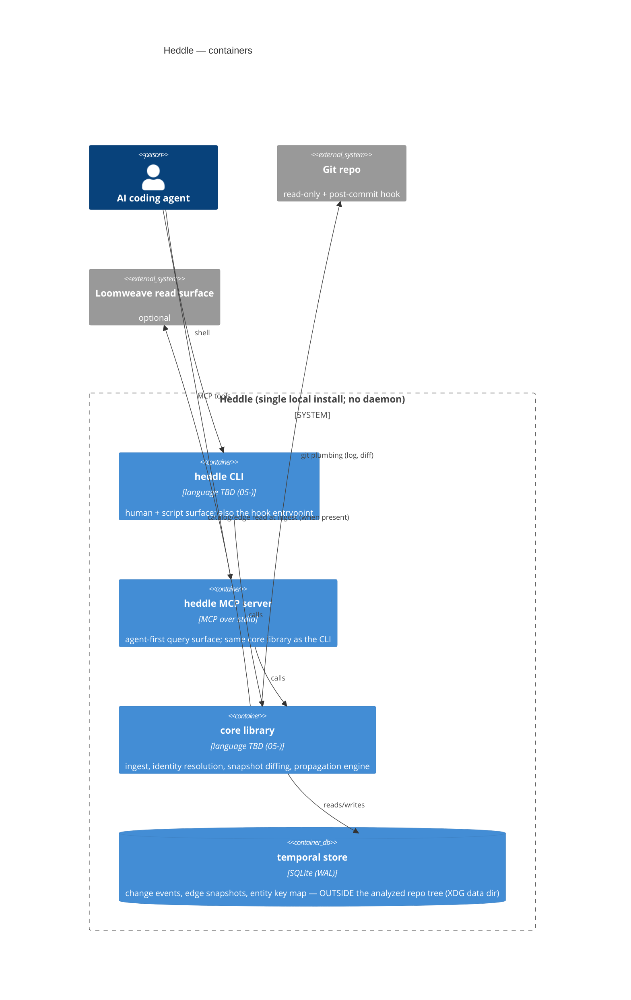

# C4 Containers

One page. Technology labels per container (provisional where `05-` defers).

- No long-running process: the MCP server runs per-session like sibling tools;
  the CLI is invoked by the git hook. (NFR-03; doctrine §6.)
- One store per analyzed repo, keyed by repo identity, never inside the repo
  working tree (NFR-05, ADR-0004).
