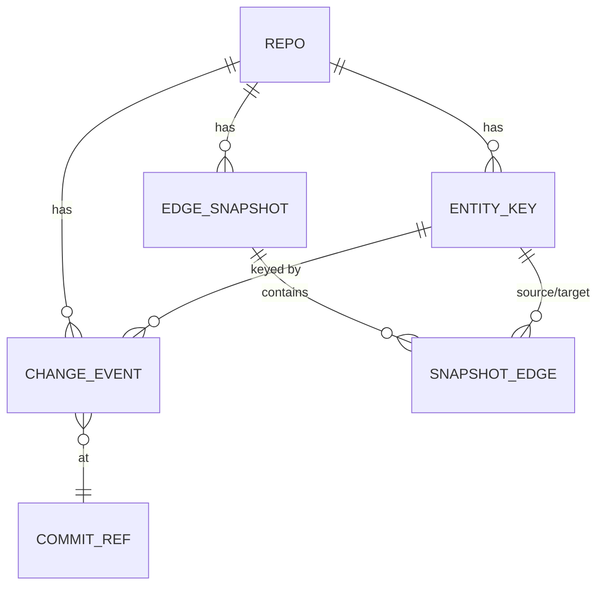

# Data Model (logical)

Owning context: **Heddle is the data owner for all entities below** — they are
temporal facts no sibling stores. Nothing here mirrors a sibling's system of
record: entity *identity* stays Loomweave's (Heddle stores only the key),
work state stays Filigree's, trust stays Wardline's, provenance verdicts stay
Legis's. (Doctrine §6; ADR-0004.)

## Entities

**REPO** — one analyzed repository.
identity (canonical path + remote fingerprint), store location. Cardinality:
1 repo → 1 store DB.

**ENTITY_KEY** — the durable key for one code entity as Heddle saw it.
`sei?` (opaque `loomweave:eid:...` string when resolved — frozen scheme,
CON-TEC-01), `locator` (path + qualname; always present), `first_seen`,
`last_seen`, upgrade lineage (locator-only → SEI-upgraded, with timestamp;
history is never rewritten, FR-07/ADR-0003). Lifecycle note: a rename that
changes the locator but preserves the SEI links keys; a rename in solo mode
creates a new key with a `possible_predecessor` edge (spike Q4 measures how
lossy this is).

**CHANGE_EVENT** — append-only; one entity touched by one commit.
entity_key, commit_ref, change_kind (added | modified | removed | moved |
signature_changed), actor (commit author + `--actor`-style string when
recoverable — recorded as given, never verified, D-04), timestamp, hunk
summary. Cardinality: commit → 0..n events.

**COMMIT_REF** — sha, parents, author, authored/committed timestamps, branch
hint. (Reference data derived from git, re-derivable; kept for query locality —
git remains the authority for commit content.)

**EDGE_SNAPSHOT** — the structural edges as read from a Loomweave surface at
ingest of commit X. snapshot_id, commit_ref, source (which surface, version),
captured_at, completeness flag (FULL | DELTA | SKIPPED). Immutable.

**SNAPSHOT_EDGE** — one directed edge within a snapshot: source entity_key →
target entity_key, edge_kind (calls | imports | inherits | references),
confidence. Cardinality: snapshot → 0..n edges; stored as deltas against the
previous snapshot where possible (NFR-02a).

**AFFECTED_SET** (query result, not stored) — changed keys + downstream keys
with depth, the snapshot staleness stamp, and per-edge provenance. Persisted
only if the consumer asks for a worklist export (FR-04).
